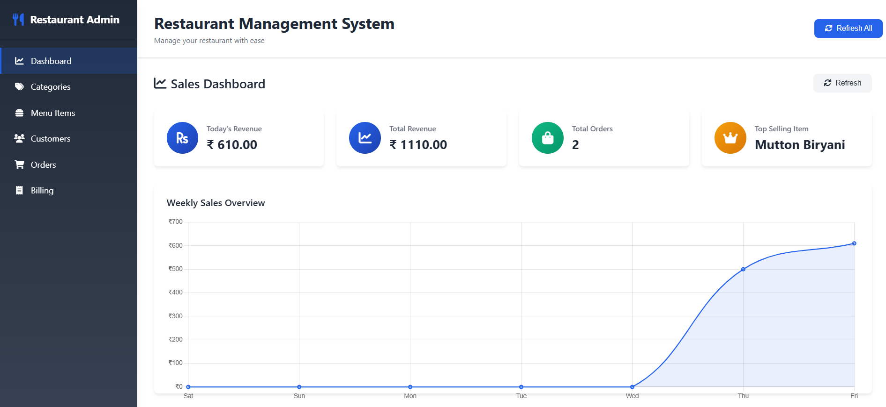
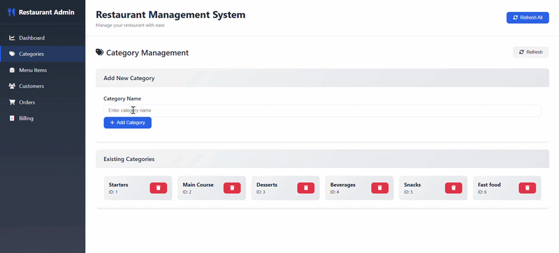
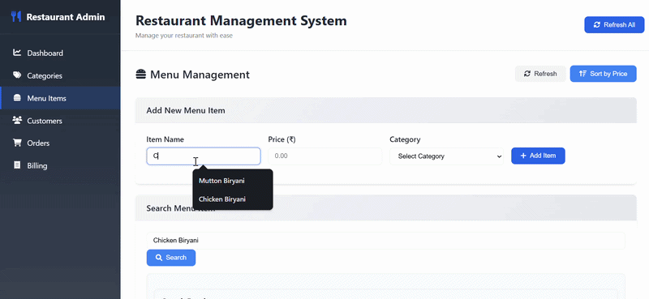
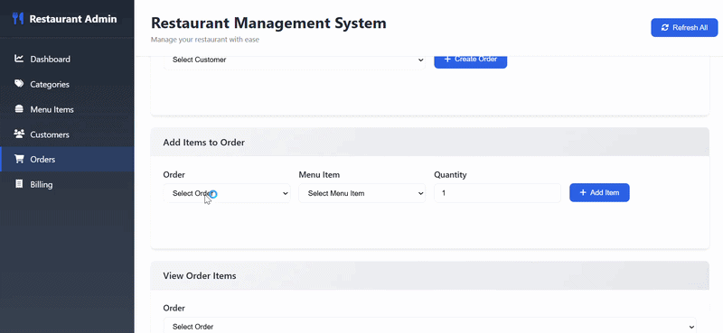
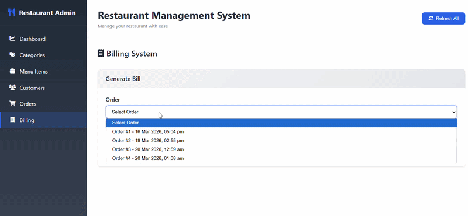

# 🍽️ Restaurant Management System

A comprehensive restaurant management system built with Spring Boot backend and modern frontend. Features include dashboard analytics, menu management, order tracking, billing system, and customer management. Ready for deployment with Vercel + Render.

---

## 🎯 **Features**

- **📊 Dashboard**: Real-time sales analytics, revenue tracking, top-selling items
- **🍽️ Category Management**: Add and manage food categories
- **🍴 Menu Management**: Add, update, and delete menu items with pricing
- **👥 Customer Management**: Customer registration and search functionality
- **📝 Order Management**: Create orders and add items
- **💳 Billing System**: Generate bills with automatic calculations
- **📱 Responsive Design**: Works on desktop and mobile devices

---

## 🛠️ **Tech Stack**

### **Backend**
- **Java 17** - Core programming language
- **Spring Boot 3.x** - Application framework
- **Spring Data JPA** - Database ORM
- **PostgreSQL 18** - Production database
- **MySQL 8.0** - Local development database
- **Maven** - Build tool

### **Frontend**
- **HTML5, CSS3, JavaScript** - Core web technologies
- **Chart.js** - Analytics visualization
- **Font Awesome** - Icon library
- **Responsive CSS Grid** - Layout system

### **Database**
- **PostgreSQL** - Production (Render)
- **MySQL** - Development (Local)

---

## 🚀 **Quick Start**

### **Prerequisites**
- Java 17+
- Maven 3.6+
- PostgreSQL 13+ (production) or MySQL 8.0+ (development)
- Node.js 16+ (optional, for frontend)

---

## 📦 **Installation**

### **1. Clone Repository**
```bash
git clone https://github.com/Shruthik-reddy/restaurant-management.git
cd restaurant-management
```

### **2. Database Setup**

#### **Option A: Local MySQL (Development)**
```sql
CREATE DATABASE restaurant_db;
```

#### **Option B: Local PostgreSQL (Development)**
```sql
CREATE DATABASE restaurant_db;
```

#### **Option C: Render PostgreSQL (Production)**
1. Go to [Render Dashboard](https://dashboard.render.com)
2. Create PostgreSQL database
3. Run `init.sql` to initialize tables

### **3. Configure Database**

Update `src/main/resources/application.properties`:

#### **For MySQL:**
```properties
spring.datasource.url=jdbc:mysql://localhost:3306/restaurant_db
spring.datasource.username=root
spring.datasource.password=your_password
spring.datasource.driver-class-name=com.mysql.cj.jdbc.Driver
```

#### **For PostgreSQL:**
```properties
spring.datasource.url=jdbc:postgresql://localhost:5432/restaurant_db
spring.datasource.username=postgres
spring.datasource.password=your_password
spring.datasource.driver-class-name=org.postgresql.Driver
```

### **4. Run Application**

#### **Backend:**
```bash
# Using Maven
mvn clean install
mvn spring-boot:run

# Using IDE
Run RestaurantManagementApplication.java
```

#### **Frontend:**
```bash
cd src/frontend

# Option 1: Python HTTP Server
python -m http.server 3000

# Option 2: Node.js
npx serve -s . -l 3000

# Option 3: VS Code Live Server
Right-click index.html → Open with Live Server
```

### **5. Access Application**
- **Frontend**: http://localhost:3000
- **Backend API**: http://localhost:8080

---

## 🎬 **Demo & Screenshots**

### **Dashboard Analytics**

*Real-time revenue tracking and sales analytics*

### **Category Management**

*Add and manage food categories*

### **Menu Management**

*Complete menu item management with pricing*

### **Order Management**

*Create and manage customer orders*

### **Billing System**

*Automatic bill generation with tax calculations*

---

## 🐳 **Docker Deployment**

### **Using Docker Compose (Recommended)**
```bash
# Start all services
docker-compose up -d

# View logs
docker-compose logs -f

# Stop services
docker-compose down
```

### **Manual Docker Build**
```bash
# Build image
docker build -t restaurant-management .

# Run container
docker run -p 8080:8080 restaurant-management
```

---

## 🌐 **Production Deployment**

### **Vercel + Render (Recommended)**

#### **Frontend Deployment (Vercel)**
1. Go to [vercel.com](https://vercel.com)
2. Click "Add New..." → "Project"
3. Import GitHub repository
4. Set **Root Directory**: `src/frontend`
5. Click "Deploy"

#### **Backend Deployment (Render)**
1. Go to [render.com](https://render.com)
2. Click "New +" → "Web Service"
3. Connect GitHub repository
4. Set **Environment Variables**:
   ```env
   SPRING_DATASOURCE_URL=jdbc:postgresql://your-db-host:5432/restaurant_db
   SPRING_DATASOURCE_USERNAME=your_username
   SPRING_DATASOURCE_PASSWORD=your_password
   FRONTEND_URL=https://your-frontend-url.vercel.app
   ```
5. Click "Create Web Service"

#### **Database Setup (Render PostgreSQL)**
1. Create PostgreSQL database on Render
2. Run `init.sql` in Query tab:
   ```sql
   -- Copy entire init.sql content here
   ```
3. Update backend environment variables with database credentials

---

## 🎯 **Key Features**

### **📊 Dashboard Analytics**
- **Today's Revenue**: Real-time daily sales tracking
- **Total Revenue**: Cumulative revenue from all orders
- **Order Statistics**: Count of billed orders
- **Top Selling Items**: Most popular menu items
- **Weekly Sales Chart**: 7-day sales trend visualization

### **🍽️ Smart Order Management**
- **Dropdown Selections**: User-friendly order and item selection
- **Real-time Updates**: Instant dashboard updates
- **Detailed Billing**: Complete receipts with item breakdown
- **GST Calculations**: Automatic tax calculations

---

## 🔧 **Configuration**

### **Database Schema**
```sql
categories     - Food categories
menu           - Menu items with pricing
customers       - Customer information
orders          - Order records
order_items     - Order item details
```

### **Environment Variables**
```env
# Database Configuration
SPRING_DATASOURCE_URL=jdbc:postgresql://host:port/database
SPRING_DATASOURCE_USERNAME=username
SPRING_DATASOURCE_PASSWORD=password

# Frontend Configuration
FRONTEND_URL=https://your-frontend-url.vercel.app

# Server Configuration
SERVER_PORT=8080
```

---

## 🧪 **Testing**

### **Run Tests**
```bash
# Run all tests
mvn test

# Run specific test
mvn test -Dtest=OrderServiceTest

# Skip tests during build
mvn clean install -DskipTests
```

### **API Testing**
```bash
# Test GET endpoint
curl http://localhost:8080/category/all

# Test POST endpoint
curl -X POST http://localhost:8080/category/add \
  -H "Content-Type: application/json" \
  -d '{"name":"Test Category"}'
```

---

## 📁 **Project Structure**

```
restaurant-management/
├── src/
│   ├── main/
│   │   ├── java/com/restaurant/
│   │   │   ├── controller/     # REST controllers
│   │   │   ├── service/        # Business logic
│   │   │   ├── repository/     # Data access layer
│   │   │   └── model/          # Entity classes
│   │   └── resources/
│   │       ├── application.properties
│   │       ├── application-prod.properties
│   │       └── init.sql          # Database initialization
│   └── frontend/
│       ├── index.html           # Main frontend file
│       ├── script.js            # JavaScript logic
│       ├── style-clean.css      # Styling
│       ├── package.json         # Node.js configuration
│       └── vercel.json         # Vercel deployment config
├── Dockerfile                 # Docker configuration
├── docker-compose.yml          # Multi-container setup
├── pom.xml                   # Maven configuration
├── render.yaml               # Render deployment config
└── README.md                 # This file
```

---

## 🤝 **Contributing**

### **Development Workflow**
1. Fork the repository
2. Create feature branch: `git checkout -b feature/amazing-feature`
3. Commit changes: `git commit -m 'Add amazing feature'`
4. Push to branch: `git push origin feature/amazing-feature`
5. Open Pull Request

### **Code Style**
- Follow Java naming conventions
- Add comments for complex logic
- Write unit tests for new features
- Update documentation

---

## 🐛 **Troubleshooting**

### **Common Issues**

#### **1. Database Connection Failed**
```bash
# Check if database is running
# MySQL
netstat -an | findstr :3306

# PostgreSQL
netstat -an | findstr :5432

# Test connection
mysql -u root -p
psql -U postgres
```

#### **2. Port Already in Use**
```bash
# Find process using port 8080
netstat -ano | findstr :8080

# Kill process
taskkill /PID <PID> /F
```

#### **3. Maven Build Failed**
```bash
# Clean and rebuild
mvn clean install -U

# Skip tests
mvn clean install -DskipTests
```

#### **4. Frontend Not Loading**
- Check if backend is running on port 8080
- Verify CORS configuration
- Check browser console for errors

### **Getting Help**
- Check [Issues](https://github.com/Shruthik-reddy/restaurant-management/issues)
- Create new issue with detailed description
- Include error logs and screenshots

---

## 📄 **License**

This project is licensed under the MIT License - see [LICENSE](LICENSE) file for details.

---

## 📞 **Support & Contact**

### **Get Help**
- **Email**: shruthikreddy0907@gmail.com
- **GitHub Issues**: [Create Issue](https://github.com/Shruthik-reddy/restaurant-management/issues)


### **Acknowledgments**
- [Spring Boot](https://spring.io/projects/spring-boot) - Excellent framework
- [Chart.js](https://www.chartjs.org/) - Beautiful analytics
- [Font Awesome](https://fontawesome.com/) - Amazing icons
- [Vercel](https://vercel.com/) - Free frontend hosting
- [Render](https://render.com/) - Free backend hosting

---

## 🎉 **Live Demo**

- **Frontend**: [https://restaurant-management-seven-gamma.vercel.app](https://restaurant-management-seven-gamma.vercel.app)
- **Backend API**: [https://restaurant-management-evgt.onrender.com](https://restaurant-management-evgt.onrender.com)

## 📊 **API Endpoints**

### **Categories**
```
GET    /category/all              - Get all categories
POST   /category/add              - Add new category
DELETE /category/delete/{id}      - Delete category
```

### **Menu Items**
```
GET    /menu/all                 - Get all menu items
POST   /menu/add                 - Add new menu item
PUT    /menu/updatePrice/{id}/{price} - Update item price
DELETE /menu/delete/{id}          - Delete menu item
```

### **Customers**
```
GET    /customer/all              - Get all customers
POST   /customer/add              - Add new customer
GET    /customer/search/{id}       - Search customer by ID
```

### **Orders**
```
GET    /order/all                 - Get all orders
POST   /order/create/{customerId}   - Create new order
POST   /order/addItem             - Add item to order
GET    /order/itemsWithDetails/{orderId} - Get order items with details
```

### **Billing**
```
GET    /order/bill/{orderId}       - Generate bill for order
```

---

## 📈 **Roadmap**

### **Version 2.0 Features**
- [ ] User authentication and authorization
- [ ] Inventory management
- [ ] Employee management
- [ ] Advanced reporting
- [ ] Mobile app
- [ ] Payment gateway integration

### **Version 1.5 Features**
- [ ] Email notifications
- [ ] SMS alerts
- [ ] Advanced search
- [ ] Data export (PDF/Excel)

---

**⭐ Star this repository if it helped you!**
